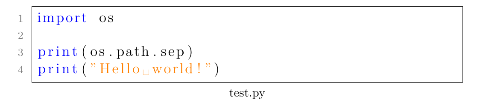

在LaTex中，要想实现代码高亮，首先需要引入宏包：

```tex
\usepackage{listings}
```

然后，设置环境：

```tex
\lstset{
	frame=single,
	basicstyle=\large,
	breaklines=true,
	captionpos=b, 
	numbers=left,
	numberstyle=\small\color{gray},
	keywordstyle=\color{blue},
	stringstyle=\color{orange},
	tabsize=4
}
```

* `frame=<none|leftline|topline|bottomline|lines|single|shadowbox>`：设置边框类型，默认为none
* `basicstyle=<style>`：设置基础样式
* `breaklines=<true|false>`：自动换行，默认为false
* `captionpos=<subset of tb>`：设置标题的位置，t表示top，b表示bottom。
* `numbers=<none|left|right>`：打印行号，默认为none
* `numberstyle=<style>`：设置行号的字体和大小
* `keywordstyle=<style>`：设置关键字的样式
* `stringstyle=<style>`：设置字符串的样式
* `tabsize=<number>`：设置制表符的大小，默认为8

最后，使用代码高亮：

```tex
\documentclass{article}

\usepackage{listings}
\usepackage{xcolor}

\lstset{
	frame=single,
	breaklines=true,
	basicstyle=\large,
	captionpos=b, 
	numbers=left,
	numberstyle=\small\color{gray},
	keywordstyle=\color{blue},
	stringstyle=\color{orange},
	tabsize=4
}

\begin{document}
\begin{lstlisting}[language=python,title=test.py]
import os

print(os.path.sep)
print("Hello world!")
\end{lstlisting}
\end{document}
```

效果如下：


