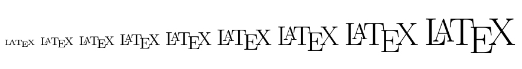

在LaTex中，预定义的字体大小如下所示：

| 字体大小      |字体大小 |
| ------------- |-------- |
| \tiny         | \large   |
| \scriptsize   | \Large   |
| \footnotesize | \LARGE   |
| \small        |  \huge    |
| \normalsize   | \Huge    |

这些预定义的字体大小有两种使用方式：

* 使用花括号申明作用域

```tex
{\tiny \LaTeX}
{\scriptsize \LaTeX}
{\footnotesize \LaTeX}
{\normalsize \LaTeX}
{\large \LaTeX}
{\Large \LaTeX}
{\LARGE \LaTeX}
{\huge \LaTeX}
{\Huge \LaTeX}
```



* 创建环境

```tex
\begin{huge}
\LaTex
\end{huge}
```

